# 📚 AI Study Assistant for Students

[](https://www.python.org/downloads/)
[](https://streamlit.io/)
[](https://huggingface.co/)

An intelligent study companion that helps students **summarize notes**, **generate quizzes**, and **create personalized study plans** from PDFs or plain text.  
No API keys – all AI models run **locally** for privacy.

Demo Screennshots:

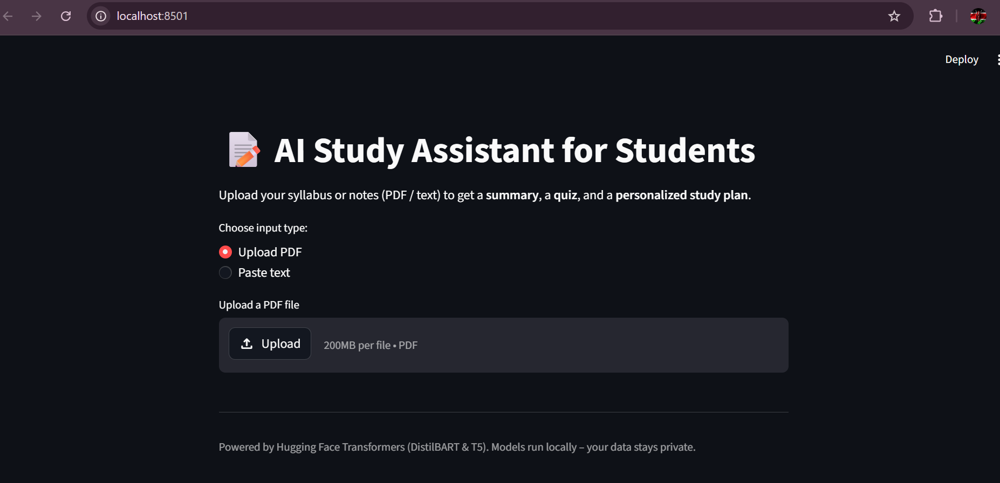

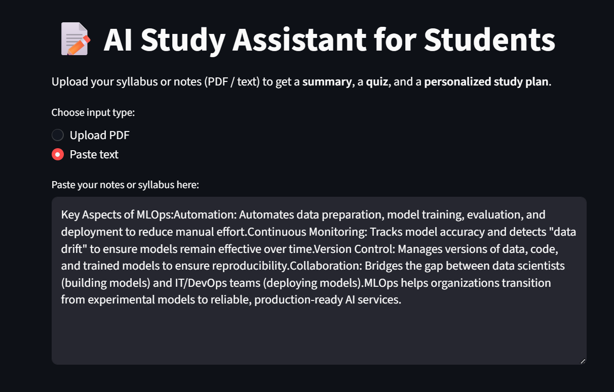

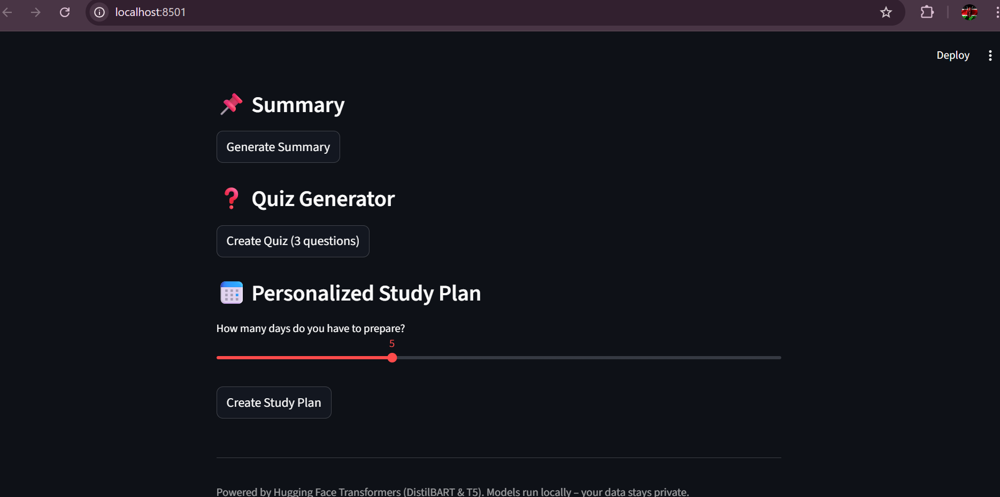

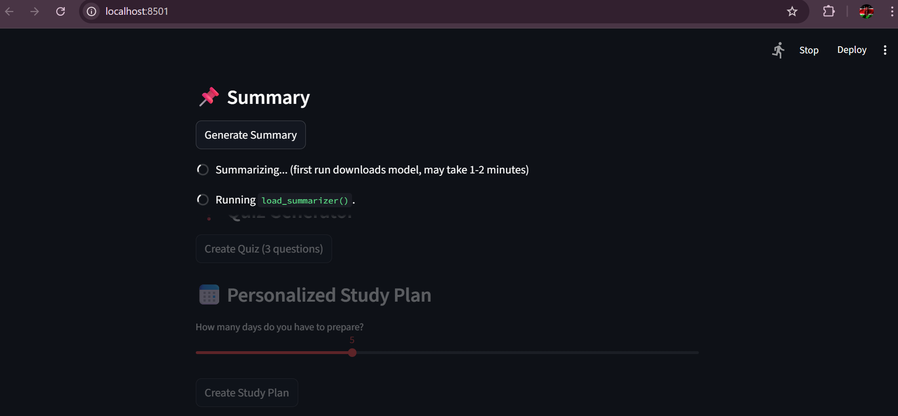

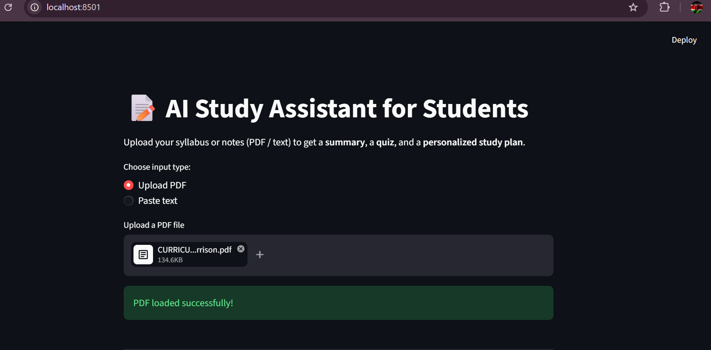

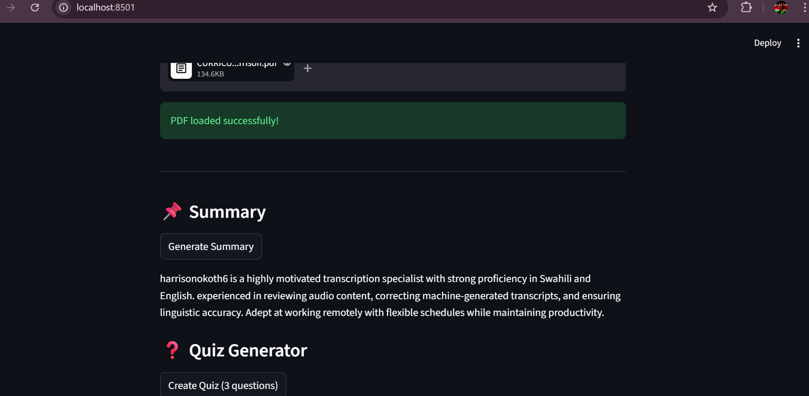

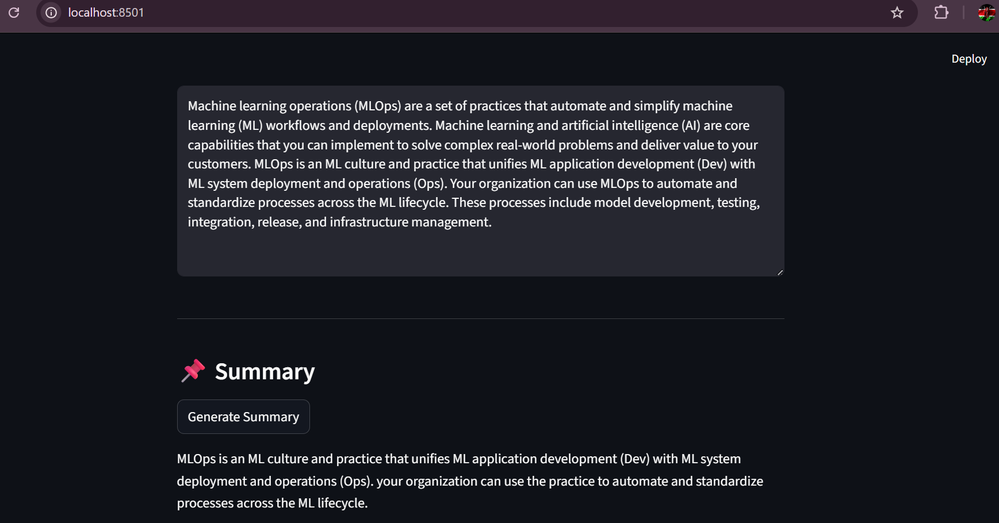

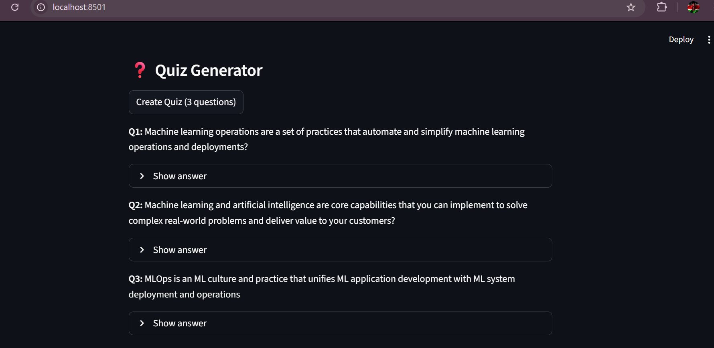

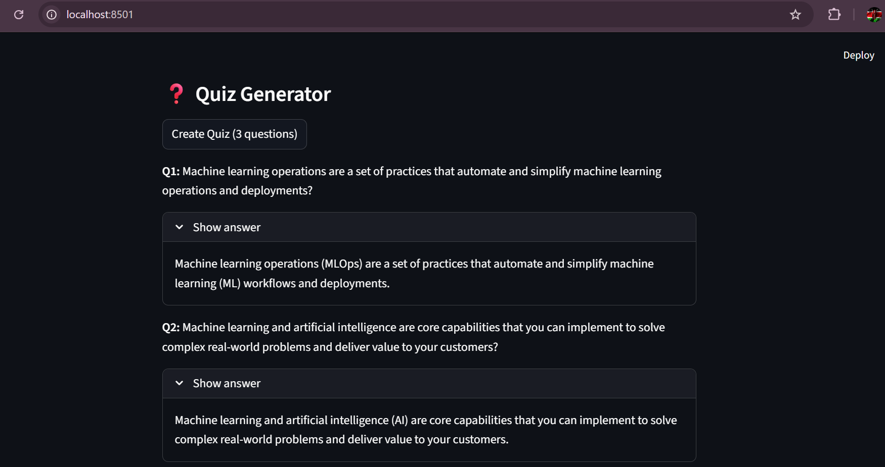

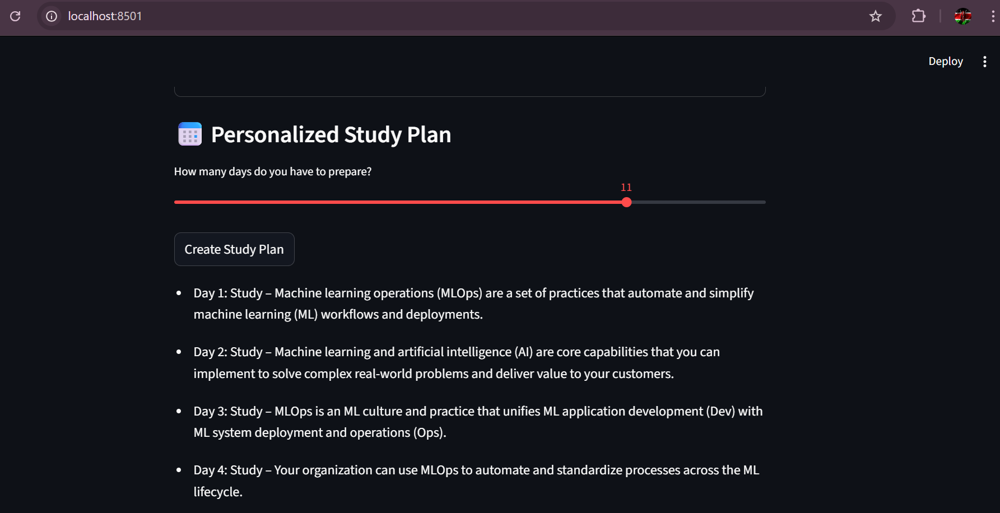

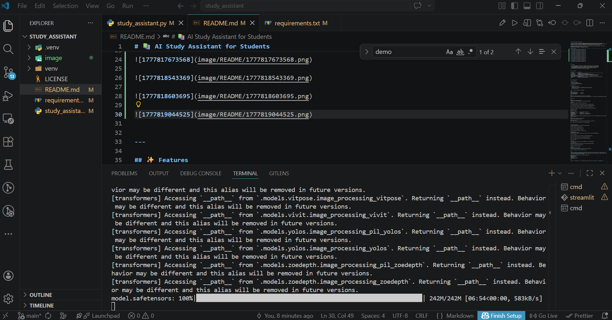


---

## ✨ Features

- **📄 PDF & Text Input** – Upload your syllabus, lecture notes, or any study material.
- **📌 AI Summarization** – Get a concise summary using DistilBART (fast & CPU-friendly).
- **❓ Quiz Generator** – Automatically create questions (and answers) from your content.
- **📅 Personalized Study Plan** – Breaks down topics into a day-by-day schedule.
- **🔒 100% Local** – Your data never leaves your computer.

---

## 🛠️ Tech Stack

| Component          | Technology                                                                 |
|--------------------|----------------------------------------------------------------------------|
| UI Framework       | [Streamlit](https://streamlit.io)                                          |
| PDF Parsing        | [PyMuPDF (fitz)](https://pymupdf.readthedocs.io/)                          |
| Summarization      | [DistilBART](https://huggingface.co/sshleifer/distilbart-cnn-12-6)         |
| Question Generation| [T5-base (fine-tuned for QG)](https://huggingface.co/mrm8488/t5-base-finetuned-question-generation) |
| NLP Pipeline       | [Hugging Face Transformers](https://huggingface.co/docs/transformers/index)|
| Runtime            | Python 3.8+ & PyTorch (CPU/GPU)                                            |

---

## 🚀 Getting Started

### Prerequisites

- Python 3.8 or higher
- pip (Python package manager)
- ~2 GB free disk space (for models)

### Installation

1. **Clone the repository**
   ```bash
   git clone https://github.com/okothwakhutu/ai-study-assistant.git
   cd ai-study-assistant


Create a virtual environment (recommended)

bash
python -m venv venv
source venv/bin/activate      # Linux/Mac
venv\Scripts\activate         # Windows
Install dependencies

bash
pip install streamlit pymupdf transformers torch sentencepiece
torch is large. For CPU-only systems, install with pip install torch --index-url https://download.pytorch.org/whl/cpu

Run the app

bash
streamlit run study_assistant.py
Your browser will open automatically at http://localhost:8501.

📖 Usage
Upload a PDF or paste your notes in the text area.

Click Generate Summary – wait 10–20 seconds (first run downloads models).

Click Create Quiz – the AI will produce 3 questions with expandable answers.

Adjust the study plan duration (1–14 days) and click Create Study Plan.

All outputs are saved in the session – you can revisit them while the app runs.

📁 Project Structure
text
ai-study-assistant/
│
├── study_assistant.py      # Main Streamlit application
├── README.md               # This file
├── requirements.txt        # (optional) List of dependencies
└── .gitignore              # Ignore venv/, __pycache__, etc.
🧪 Example Outputs
Summary
"The Krebs cycle produces ATP through oxidation of acetyl-CoA. It occurs in the mitochondrial matrix and requires oxygen indirectly..."

Quiz
Q1: Where does the Krebs cycle take place?
Answer: In the mitochondrial matrix.

Study Plan (5 days)
Day 1: Study – The Krebs cycle produces ATP through oxidation of acetyl-CoA.

Day 2: Study – It is a central part of cellular respiration.

...

🔧 Future Improvements
Multiple‑choice quiz generation (instead of open questions)

Progress tracking with calendar view

Spaced repetition flashcards (Anki export)

Voice input / text‑to‑speech for answers

Deploy on Hugging Face Spaces / Streamlit Cloud

🤝 Contributing
Contributions are welcome!
Feel free to open an issue or submit a pull request. Please follow basic PEP8 guidelines.

Fork the repository

Create your feature branch (git checkout -b feature/amazing-feature)

Commit your changes (git commit -m 'Add some amazing feature')

Push to the branch (git push origin feature/amazing-feature)

Open a Pull Request

📄 License
Distributed under the MIT License. See LICENSE file for more information.

🙏 Acknowledgements
Hugging Face for the amazing Transformers library and pre‑trained models.

Streamlit for making ML apps effortless.

PyMuPDF for PDF text extraction.

📬 Contact
Okoth Wakhutu – @okothwakhutu
Project Link: https://github.com/okothwakhutu/ai-study-assistant

⭐️ If this helped you, give the repository a star!


Also, create a `requirements.txt` for easier installation:
streamlit>=1.28.0
pymupdf>=1.23.0
transformers>=4.35.0
torch>=2.0.0
sentencepiece>=0.1.99

text

Save it as `requirements.txt` in the same folder – then users can run `pip install -r requirements.txt`.
